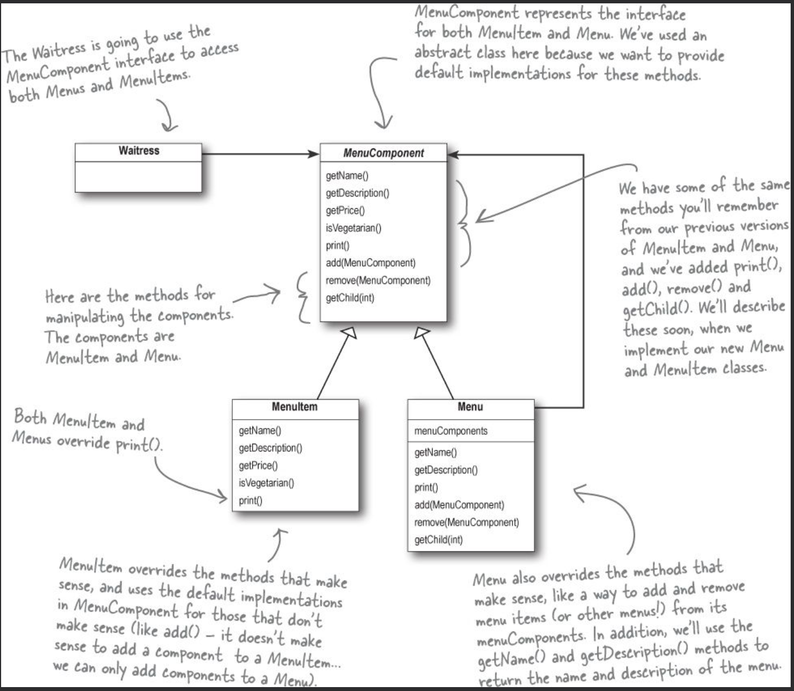

# Composite Pattrn

## Need for a composite pattern (moving on from our iterator pattern example)

They want to add a dessert submenu. That should work with our iteration code as well.. the way we were iterating.. we could only interate over a `Menu` which has `MenuItem`s. What about a `Menu` with `MenuItem`s and `Menu`? Our iteration code will fail there and also, our `Menu`s can't hold other `Menu`s, only `MenuItem`s

We can’t assign a dessert `Menu` to a `MenuItem` array for example.

## So, what is it we really need out of our new design?

The time has come to make an executive decision to rework the chef’s implementation into something that is general enough to work over all the `Menu`s (and now `submenu`s). That’s right, we’re going to tell the chefs that the time has come for us to **Reimplement** their `Menu`s.

> _*note: In iterator Pattern, we just implemented an interface for `Menu`s returning a new iterator object. Main work was on creating an Iterator Class per `Menu`, those iterators were the one responsible for iterating. But here, we need to greatly **modify** the structure of our `Menu`s for them to be able to incorporate `Menu`s and `MenuItem`s.*_

For us to have `Menu` as well as `MenuItem` inside a `Menu` and iterate over them seamlessly, we need to somehow make `Menu` and `MenuItem` the same type.

We need some kind of a tree-shaped structure that will accommodate menus, submenus, and menu items.

We need to make sure we maintain a way to traverse the items in each menu that is at least as convenient as what we are doing now with iterators.

We may need to traverse the items in a more flexible manner. For instance, we might need to iterate over only the Diner’s dessert menu, or we might need to iterate over the Diner’s entire menu, including the dessert submenu.

## Solution

By putting menus and items in the same structure we create a part-whole hierarchy; that is, a tree of objects that is made of parts (menus and menu items) but that can be treated as a whole, like one big über menu.

Once we have our über menu, we can use this pattern to treat “individual objects and compositions uniformly.” What does that mean? It means if we have a tree structure of menus, submenus, and perhaps subsubmenus along with menu items, then any menu is a “composition” because it can contain both other menus and menu items. The individual objects are just the menu items — they don’t hold other objects. As you’ll see, using a design that follows the Composite Pattern is going to allow us to write some simple code that can apply the same operation (like printing!) over the entire menu structure.

> _*node: Because some of these methods only make sense for MenuItems, and some only make sense for Menus, the default implementation is UnsupportedOperationException. That way, if MenuItem or Menu doesn’t support an operation, they don’t have to do anything; they can just inherit the default implementation.*_
